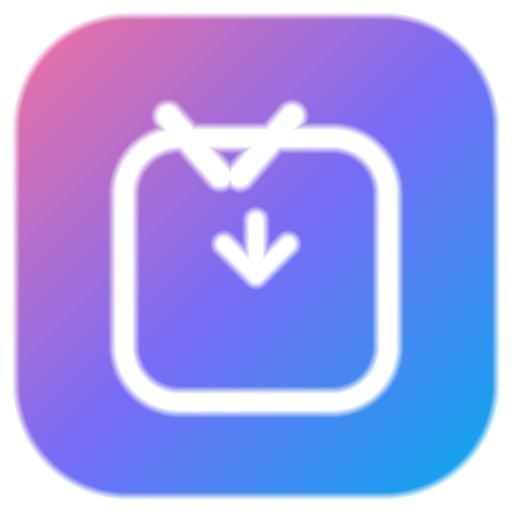
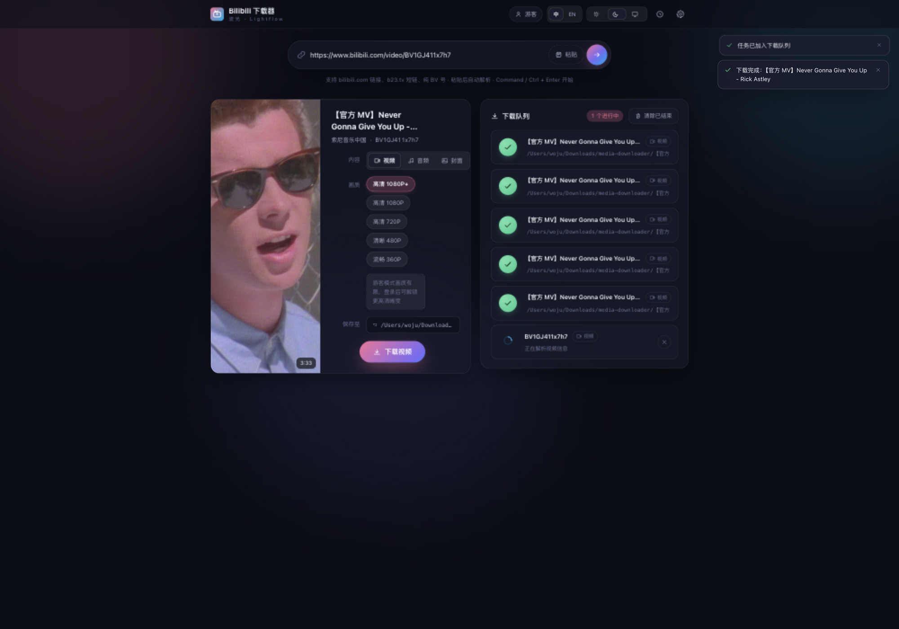

# media-downloader

<p align="center">
  
</p>

<h3 align="center">Bilibili 下载器 · 流光</h3>

<p align="center">
  一个本地运行的 B 站视频 / 音频 / 封面下载器。<br/>
  Go 单二进制后端 + 全新设计的 Web 界面，支持 macOS 与 Windows。
</p>

<p align="center">
  
  
  
  
</p>

---

## 简介

流光（Lightflow）是本仓库的图形界面应用：双击启动后自动打开浏览器界面，粘贴 B 站链接即可下载视频、音频或封面图。所有数据只在本机处理，不上传任何信息。

本仓库同时收录同一个下载器的多语言实现（C / C++ / Go / Java / JavaScript / Python），作为各语言的对照参考；正式的图形界面应用位于 [`app/`](app/) 目录。



## 功能特性

- **视频下载**：优先走 DASH 流并用 ffmpeg 合并高画质（登录后可到 1080P+ / 4K / 高帧率）；未安装 ffmpeg 时自动回退到自带声音的普通画质
- **音频下载**：DASH 音轨直存 M4A，或经 ffmpeg 转码为 MP3；支持标准 / 较高 / 高品 / 杜比 / Hi-Res 档位（视视频与账号而定）
- **封面下载**：原图质量 JPG
- **画质选择**：解析后按账号实际权限列出全部可用档位
- **登录态导入**：一键从本机 Chrome / Edge / Firefox / Safari 读取 B 站 Cookie（macOS 读取 Chrome / Safari 时系统会请求钥匙串与磁盘访问权限，允许即可）；也支持手动粘贴 SESSDATA
- **实时进度**：SSE 事件流推送，进度环、速度、剩余大小实时刷新，任务可取消
- **下载历史**：本地 JSON 持久化，可回看文件位置、单条删除、清空
- **多分 P 支持**：解析多 P 视频时可选择具体分集
- **原生目录选择**：macOS / Windows 系统文件夹选择框，保存路径自动记忆
- **亮暗双主题**：浅色 / 深色 / 跟随系统三态切换，平滑过渡
- **中英双语**：界面一键切换中英文（顶栏语言切换），选择持久化
- **单文件分发**：前端资源全部嵌入二进制，只有一个可执行文件

## 下载安装

在 [Releases](https://github.com/Wojusensei/media-downloader/releases) 页面按系统选择：

| 平台 | 文件 | 说明 |
|------|------|------|
| macOS（Apple Silicon 与 Intel） | `MediaDownloader_x.x.x_macos_universal.dmg` | 拖入 Applications 即用，通用二进制 |
| Windows x64 | `MediaDownloader_x.x.x_windows_x64.exe` | 绝大多数 PC |
| Windows arm64 | `MediaDownloader_x.x.x_windows_arm64.exe` | ARM 版 Windows 设备 |

**首次启动**：双击运行后会自动打开浏览器界面（macOS 为 `.app`，Windows 为单个 `.exe`）。应用只监听本机回环地址，不对外网开放。

**macOS 提示**：应用未做开发者签名，首次打开请右键点击应用选择「打开」，或在「系统设置 - 隐私与安全性」中允许。

**Windows 提示**：`.exe` 会显示一个控制台窗口，里面是服务状态日志，关闭窗口即退出应用；若 SmartScreen 弹窗，选择「仍要运行」。

### 可选：安装 ffmpeg 解锁高画质

- macOS：`brew install ffmpeg`
- Windows：`winget install Gyan.FFmpeg`（或从 [ffmpeg.org](https://ffmpeg.org) 下载后加入 PATH）

未安装 ffmpeg 时视频仍可下载（自带声音的标准画质），音频保存为 M4A。

## 使用指南

1. 启动应用，浏览器会自动打开界面
2. 粘贴视频链接（支持完整链接、`b23.tv` 短链、纯 BV 号），粘贴后自动解析
3. 在左侧卡片选择内容类型、画质 / 音质、保存位置
4. 点击下载，右侧队列实时展示进度
5. （可选）在设置中导入浏览器登录态，解锁更高清晰度

## 从源码构建

依赖：Go 1.26+、Node.js 20+；打包 Windows 产物另需 `goversioninfo`（脚本自动调用）。

```bash
cd app

# 开发模式（Vite 热更新 + Go 服务）
make dev

# 测试与静态检查
make test

# 全平台打包（macOS universal .app + dmg、Windows x64/arm64 exe → dist/）
make package
```

Windows 的 exe 通过 `GOOS=windows` 在本机直接交叉编译生成，无需 Windows 环境或 Wine。macOS 的 dmg 由 `hdiutil` 制作。

### 目录结构

```
app/
├── cmd/media-downloader/   # 入口：端口、静态资源、浏览器唤起、优雅退出
├── internal/
│   ├── bilibili/           # B 站 API：视频信息、画质、DASH / 传统流、封面代理
│   ├── cookies/            # 浏览器 Cookie 导入（kooky）与手动 SESSDATA
│   ├── download/           # 下载引擎：任务状态机、重试、进度事件、ffmpeg 合并
│   ├── history/            # 历史记录 JSON 持久化
│   ├── platform/           # 跨平台差异：目录选择、默认路径、ffmpeg 探测
│   └── server/             # HTTP 服务：REST + SSE + 设置存储
├── web/                    # 前端（Vite + React + TypeScript，构建产物嵌入二进制）
├── tools/icongen/          # 纯 Go 图标生成器（绘制应用图标并输出 ICNS / ICO）
└── build/                  # 打包脚本与资源配置
```

## 常见问题

**Q：下载的视频最高只有 480P？**
游客模式只能拿到有限清晰度。在设置中导入浏览器登录态（需该浏览器已登录 B 站）即可解锁 1080P；大会员可解锁 1080P+ / 4K 等。

**Q：为什么需要 ffmpeg？**
B 站高画质视频的音频和视频是分离的 DASH 流，需要 ffmpeg 无损合并；MP3 转码也依赖它。不安装也能用，只是画质回退。

**Q：Cookie 安全吗？**
Cookie 只保存在本机的用户配置目录（`~/Library/Application Support/media-downloader` 或 `%APPDATA%\media-downloader`），仅用于向 B 站 API 发起请求，不会发往任何第三方。

**Q：多语言目录（c / cpp / go / java / javascript / python）是什么？**
这是仓库最初的形态：用六种语言实现同一个命令行下载器，作为学习对照。图形界面应用（v4.0 起）与它们相互独立。

## 说明

- 本项目仅供个人学习与备份用途，请尊重创作者权益，勿用于任何侵犯版权或违反 B 站用户协议的用途
- 下载清晰度等能力受 B 站接口策略限制，随账号权限变化

## 许可

本项目采用 [MIT License](LICENSE) 开源。

应用构建与分发中链接的第三方库及其许可证，见[第三方依赖声明](THIRD_PARTY.md)。
